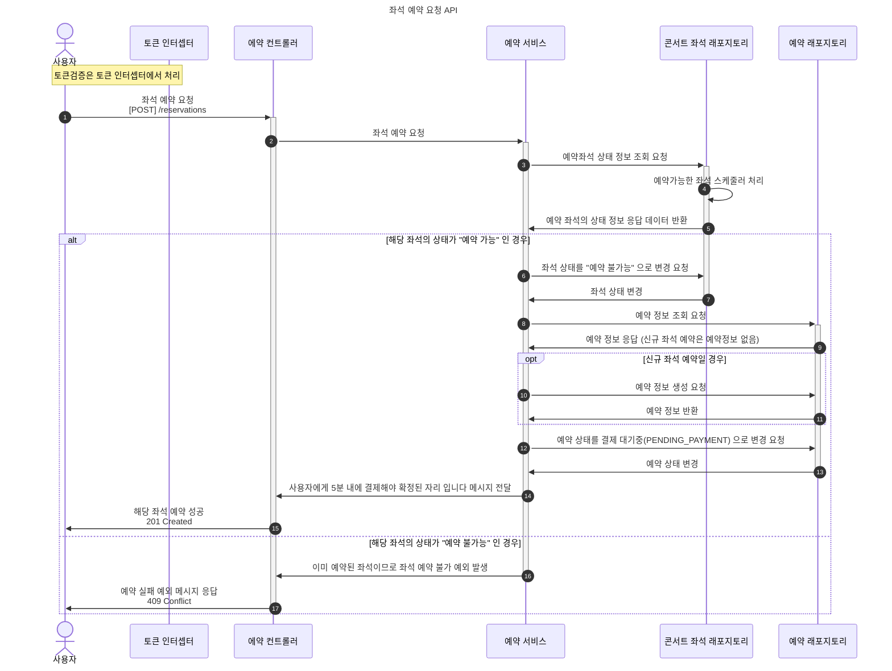

## ERD 개선하기

> - 보완피드백1: 유저와 토큰 테이블 분리하기
>
> - 보완피드백2: 테이블의 역할을 고민해서 만들기
>
>   payments 라는 엔티티에 금액정보가 없어서 책임을 다하지 못할 수 있음.

### As-Is (1차 설계)

### To-Be (2차 설계)

- 테이블개수를 6개 -> 8개 로 확장했습니다.
  - 토큰(tokens) 테이블 추가
  - 포인트 내역(point_histories) 테이블 추가
- payments 테이블에 결제금액(price) 를 추가하여 결제에 대한 책임을 부여했습니다.
- 2차 설계안 고민포인트 1번을 참고하여, 날짜에서 예약가능여부(is_available)을 추가했습니다.

### ERD 2차 설계안 고민포인트

1. 대기열토큰의 대기순서를 나타내려면, 토큰테이블에 대기순서를 기재하는게 좋을까요 아니면 대기열큐를 하나의 테이블로 나타내어 대기순서를 기재하는게 좋을까요?

멀티스레드의 동시성을 고려하게될텐데 여기서는 대기열이 동시성을 담당하는거 같습니다. 계속 대기열도 테이블로 나타내려고하는데 아직도 혼란이 남은거같아 질문을 드립니다.

2. 좌석예약 뿐만 아니라 날짜예약이 가능 여부에 대한 고려가 필요한거 같습니다.

이전에는 좌석의 예약 가능여부만 생각해왔습니다. 좌석예약하기전 날짜 선택도 예약 가능여부를 고려하는 것을 놓쳤습니다. 콘서트에서 예약가능한 날짜를 선택할 때 고려사항 2가지가 있습니다.

> - (고려사항 1) 콘서트의 예약가능한 날짜목록은 현재를 기준으로 현재~미래 날짜인지?
>
>   예약가능한 날짜가 현재기준으로 과거날짜면 이미 종료됐으므로 예약불가능 을 나타내야합니다.
>
> - (고려사항 2) 예약가능한 날짜에서 이미 좌석이 만석됐을 경우

(고려사항 1)의 경우에는 매일 0시에 배치 스케줄러로 상태값을 '예약불가능'(`is_available = false`)으로 변경이 필요할거 같습니다.

(고려사항 2)의 경우에도 좌석이 예약가능한 날짜의 예약좌석수가 만석인지 아닌지를 확인하고 만석이라면 '예약불가능'(`is_available = false`) 으로 상태값을 변경해야하며 실시간으로 상태값 변경을 나타낼 필요가 있습니다.

(고려사항1)과 (고려사항2)를 고려해보면 스케줄러 2개를 추가해야될거 같습니다.
실제라면 예약가능한 날짜도 예약가능한지 아닌지 실시간으로 공유가 필요해보이지만 제가 오버엔지니어링을 한게 아닌가 의문이 들기도합니다.

### 설계를 하면서 깨달은 설계에 대한 나의 철학

1. Seat 테이블에 왜 price 컬럼이 있나요?

콘서트나 뮤지컬 연극의 경우에는 좌석에 따라 가격이 다르기 때문입니다. 영화관의경우에는 좌석별 자리보다는 영화관이 어떤 장소냐(4DX, 일반 2D, 3D 등)에 따라 가격이 다른편입니다. 실제 사례를 봤을때 콘서트의 경우에는 영화관처럼 모든 좌석의 가격을 동일하게 하는 것보다는 좌석마다 가격을 다르게하는 방안으로 선택했습니다.

---

## 시퀀스 다이어그램

> 보완피드백 1: 비즈니스 로직의 이해를 높이고자 시퀀스 다이어그램에서 적절한 상태임을 가정하는 케이스가 많은데, 핵심 예외에 대해서는 시퀀스 다이어그램에 표현
>
> 보완피드백 2: 좌석예약 요청 API에서 예약서비스에 콘서트 좌석의 상태 확인을 요청하는데 예약서비스에서 해당 구현이 가능한지 다시 생각해보기.

여기서는 좌석예약 요청 API 에서만 공개하고 나머지는 [2차 시퀀스 다이어그램 위키문서](https://github.com/loveAlakazam/hh-08-concert/wiki/03_%EC%8B%9C%ED%80%80%EC%8A%A4%EB%8B%A4%EC%9D%B4%EC%96%B4%EA%B7%B8%EB%9E%A8_2nd)에 기재했습니다.

### 좌석예약 요청 API 개선

---

## 플로우차트

> 보완피드백 1: 전체적인 흐름은 시퀀스다이어그램보다 플로우차트로 나타내기

---

## 느낀점

설계는 고민을 많이 해야되고 해당 서비스에 대해 시간을 많이 투자가 필요하다는 걸 깨달았습니다.

무엇보다도 설계를 하기전에 서비스에 대한 이해가 필요하다는걸, 1차설계에는 기한내에 과제제출에 급해서 서비스에 대한 이해와 고민을 깊게하지 못했다는 생각이 들었습니다.
다른사람들보다 설계에 시간을 투자하지 못했지만 지금이라도 API를 코드로 구현하기전에 명확한 설계를 만들어보고 싶었습니다.

설계에 대한 날카로운 피드백을 주셨는데 제게 많이 도움을 받았습니다.
아직도 부족함을 느끼지만, 그래도 피드백을 주시면 감사하겠습니다. 읽어주셔서 감사합니다.
